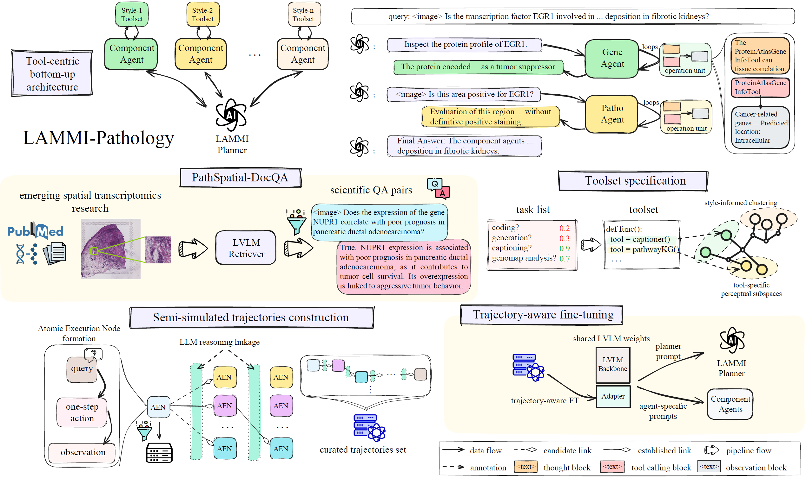
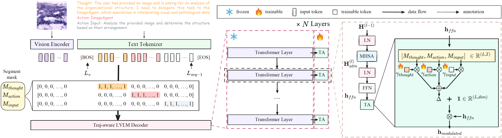
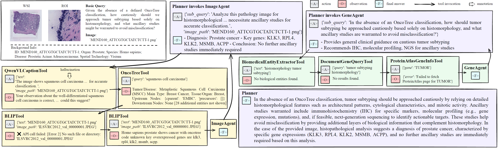

# LAMMI: Hierarchical Multi-Agent Reasoning for Pathology-Molecular Intelligence

[]()
[]()
[]()

> Official repository of **LAMMI**.
> Hierarchical LVLM-driven multi-agent framework for pathology-molecular, tool-grounded reasoning.

## Core Ideas

- **Scalable hierarchical architecture (anti-task-drift):** Planner-led decomposition with component agents enables stable long-horizon reasoning.
- **Execution-grounded AEN:** each reasoning unit is derived from real tool feedback, `AEN = (Query, Action, Observation)`.
- **Trajectory-Aware Finetuning (TA):** optimize on executable trajectories to improve tool-use consistency and final-answer reliability.

## LAMMI Architecture



- Planner-level decomposition.
- Specialist-level execution (`ImageAgent`, `GeneAgent`, ...).
- Extensible component-agent design for plug-and-play expansion to diverse vertical domains.

## TA Finetuning



- TA objective: learn executable tool trajectories, not only final answers.
- Better tool consistency; lower redundancy and hallucination in long-chain runs.

## Evaluation Scope

- **PathSpatial-DocQA**
- **ST-Traj**
- **PathMMU**

## Inference Case Overview



- Multi-tool evidence aggregation.
- Failure recovery and trajectory correction.

## Citation

BibTeX will be updated after acceptance.

```bibtex
@article{lammi2026,
  title   = {LAMMI: Hierarchical Multi-Agent Reasoning for Pathology-Molecular Intelligence},
  author  = {Anonymous},
  journal = {arXiv preprint},
  year    = {2026}
}
```
